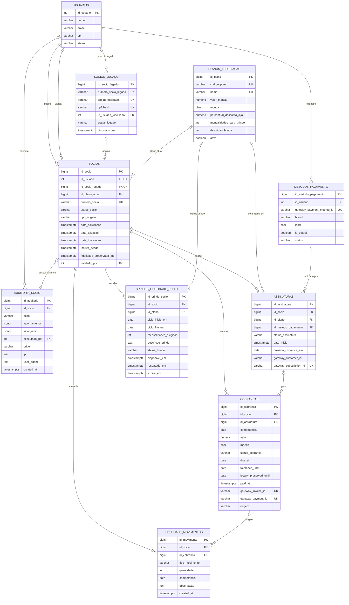

# DER — Domínio de Sócios

Este documento apresenta o **Diagrama de Entidade e Relacionamento (DER)** do domínio de sócios do APP Savóia.

O objetivo é facilitar manutenção, onboarding e evolução futura do backend, mantendo uma visão única dos relacionamentos entre cadastro, associação, planos, pagamentos, fidelidade e brindes.

> Fonte de verdade: este DER foi montado a partir das migrations versionadas do projeto. Em caso de divergência, a estrutura efetivamente criada pelas migrations prevalece.

## Escopo

O diagrama cobre as tabelas relacionadas ao domínio de sócios atualmente existentes:

- `usuarios`;
- `socios_legado`;
- `planos_associacao`;
- `socios`;
- `auditoria_socio`;
- `metodos_pagamento`;
- `assinaturas`;
- `cobrancas`;
- `fidelidade_movimentos`;
- `brindes_fidelidade_socio`.

A tabela `usuarios` já existia antes das migrations do domínio de sócios. Por isso, o diagrama mostra apenas os campos de `usuarios` relevantes para os relacionamentos deste domínio, e não pretende documentar a tabela inteira.

## DER visual



## Leitura rápida do modelo

### `usuarios`

Representa a **conta de acesso ao app**.

Usuário e sócio são conceitos diferentes:

```text
usuario = conta/login
socio   = vinculo associativo com a Savoia
```

Um usuário pode existir sem possuir registro em `socios`.

### `socios`

É a entidade central do vínculo associativo.

Ela relaciona:

- o usuário autenticável (`id_usuario`);
- um registro legado opcional (`id_socio_legado`);
- o plano atual opcional (`id_plano_atual`);
- número e status do sócio;
- datas de solicitação, ativação e inativação;
- origem do vínculo;
- janela de preservação de fidelidade.

A unicidade de `socios.id_usuario` garante fisicamente a regra:

```text
um usuario pode ter no maximo um registro em socios
```

Estados atualmente aceitos em `status_socio`:

```text
pending_validation
active
inactive
blocked
cancelled
```

Esses são estados internos. A API apresenta `active` como `socio_ativo`; apresenta `pending_validation`, `inactive`, `blocked` e `cancelled` como `socio_inativo`; e usa `nao_socio` quando não existe registro em `socios`.

`tipo_origem`, incluindo `legacy_import`, descreve a origem do vínculo e não é um estado visual.

### `socios_legado`

Armazena a base histórica/importada de sócios antigos.

O vínculo com o usuário é feito principalmente por CPF no fluxo atual. Um registro legado pode posteriormente ser relacionado a um registro real em `socios`.

A coluna `id_socio_legado` em `socios` possui índice único quando preenchida, impedindo que o mesmo registro legado seja usado por dois registros de sócio.

### `planos_associacao`

É o catálogo de planos.

Atualmente concentra dados como:

- código do plano;
- nome;
- valor mensal;
- moeda;
- percentual de desconto nas lojas;
- quantidade de mensalidades para liberar o brinde;
- descrição do brinde;
- status ativo/inativo.

Os planos atuais são `mutley` (R$ 30,00 e 10% de desconto), `dick` (R$ 50,00 e 15%) e `vigarista` (R$ 75,00 e 20%). Todos usam a regra de brinde após 12 mensalidades consecutivas pagas.

As regras completas estão em [Benefícios e brindes de fidelidade](./beneficios-fidelidade.md).

### `auditoria_socio`

É o histórico de mudanças relevantes do vínculo associativo.

Enquanto `socios` representa **como o vínculo está agora**, `auditoria_socio` registra **como ele chegou ao estado atual**.

Exemplos de eventos:

```text
legacy_member_linked
association_requested
regularization_requested
```

A auditoria pode registrar:

- valor anterior;
- valor novo;
- usuário que executou a ação;
- origem (`app`, `sistema`, `backoffice`, `importacao`, `gateway`);
- IP;
- user-agent;
- data/hora.

### `metodos_pagamento`

Representa referências tokenizadas de métodos de pagamento.

Não deve armazenar número completo de cartão nem CVV.

Um usuário pode possuir vários métodos, mas existe índice parcial que permite apenas um método ativo marcado como padrão por usuário.

### `assinaturas`

Representa a **recorrência** de um sócio em um plano.

Uma assinatura aponta para:

- um sócio;
- um plano;
- opcionalmente um método de pagamento.

Existe índice parcial garantindo no máximo uma assinatura corrente por sócio nos estados:

```text
pending
active
paused
failed
```

### `cobrancas`

Representa cada cobrança individual de uma competência.

Exemplo conceitual:

```text
assinatura Mutley
  -> cobranca 09/2026
  -> cobranca 10/2026
  -> cobranca 11/2026
```

Uma cobrança sempre pertence a um sócio e pode estar vinculada a uma assinatura.

Estados aceitos:

```text
scheduled
pending
paid
failed
cancelled
refunded
```

Ela também possui campos preparados para tolerância de inadimplência e preservação de fidelidade.

### `fidelidade_movimentos`

Funciona como um **ledger/extrato de fidelidade**.

Em vez de guardar apenas um contador final, registra os movimentos que compõem o saldo:

```text
+1 payment_counted
-1 payment_reversed
+N manual_adjustment
-N loyalty_reset
```

Um movimento pertence a um sócio e pode apontar para a cobrança que o originou.

### `brindes_fidelidade_socio`

Representa um direito a brinde efetivamente liberado para um sócio.

É separado dos benefícios gerais do plano.

Estados aceitos:

```text
available
redeemed
cancelled
expired
```

O resgate é presencial na sede e sujeito à disponibilidade de estoque.

## Relacionamentos físicos e comportamento de deleção

| Origem | FK | Destino | Cardinalidade física relevante | `ON DELETE` |
|---|---|---|---|---|
| `socios` | `id_usuario` | `usuarios` | usuário 1 -> 0..1 sócio | `CASCADE` |
| `socios` | `id_socio_legado` | `socios_legado` | 0..1 <-> 0..1 por índice único | `SET NULL` |
| `socios` | `id_plano_atual` | `planos_associacao` | plano 1 -> N sócios | `SET NULL` |
| `socios` | `validado_por` | `usuarios` | usuário 1 -> N validações | `SET NULL` |
| `socios_legado` | `id_usuario_vinculado` | `usuarios` | legado 0..1 -> usuário | `SET NULL` |
| `auditoria_socio` | `id_socio` | `socios` | sócio 1 -> N auditorias | `SET NULL` |
| `auditoria_socio` | `executado_por` | `usuarios` | usuário 1 -> N auditorias | `SET NULL` |
| `metodos_pagamento` | `id_usuario` | `usuarios` | usuário 1 -> N métodos | `CASCADE` |
| `assinaturas` | `id_socio` | `socios` | sócio 1 -> N assinaturas históricas | `CASCADE` |
| `assinaturas` | `id_plano` | `planos_associacao` | plano 1 -> N assinaturas | `RESTRICT` |
| `assinaturas` | `id_metodo_pagamento` | `metodos_pagamento` | método 1 -> N assinaturas | `SET NULL` |
| `cobrancas` | `id_socio` | `socios` | sócio 1 -> N cobranças | `CASCADE` |
| `cobrancas` | `id_assinatura` | `assinaturas` | assinatura 1 -> N cobranças | `SET NULL` |
| `fidelidade_movimentos` | `id_socio` | `socios` | sócio 1 -> N movimentos | `CASCADE` |
| `fidelidade_movimentos` | `id_cobranca` | `cobrancas` | cobrança 1 -> N movimentos possíveis | `SET NULL` |
| `brindes_fidelidade_socio` | `id_socio` | `socios` | sócio 1 -> N brindes/ciclos | `CASCADE` |
| `brindes_fidelidade_socio` | `id_plano` | `planos_associacao` | plano 1 -> N brindes | `SET NULL` |

## Restrições importantes de integridade

### Um único sócio por usuário

Garantido por:

```text
ux_socios_id_usuario
```

### Um único uso de registro legado em `socios`

Garantido por:

```text
ux_socios_id_socio_legado
```

quando `id_socio_legado` não é nulo.

### Uma assinatura corrente por sócio

Garantido por:

```text
ux_assinaturas_socio_corrente
```

para assinaturas em `pending`, `active`, `paused` ou `failed`.

### Um método de pagamento padrão ativo por usuário

Garantido por:

```text
ux_metodos_pagamento_default_por_usuario
```

## Pontos de atenção para evoluções futuras

### Vínculo de `socios_legado` com `usuarios`

`id_usuario_vinculado` possui índice de busca, mas **não possui constraint `UNIQUE`** na migration atual.

O fluxo automático atual protege o vínculo em nível de serviço, porém o banco, isoladamente, permite que mais de uma linha de `socios_legado` referencie o mesmo usuário.

Caso a regra definitiva seja 1:1 também nesse vínculo auxiliar, uma migration futura pode reforçar essa restrição no banco.

### Duplicidade de cobrança por competência

A estrutura atual não possui índice único em algo como:

```text
(id_socio, competencia)
```

ou:

```text
(id_assinatura, competencia)
```

Quando a geração automática de cobranças for implementada, a estratégia de idempotência deve ser definida antes de produção e, se adequado, reforçada com constraint/índice no banco.

### Idempotência da fidelidade

`fidelidade_movimentos` é um ledger, mas ainda não possui uma chave única que impeça, por exemplo, contabilizar a mesma cobrança duas vezes em eventos concorrentes.

Antes da integração financeira real, deverá ser definida a chave de idempotência do movimento financeiro/fidelidade.

## O que ainda não faz parte deste DER

Ainda não existem tabelas definitivas para:

- carteirinha digital;
- QR Code;
- estoque real de brindes;
- backoffice/sistema de gerenciamento;
- cupom para loja online.

Essas entidades devem ser incorporadas ao DER somente quando forem efetivamente modeladas e versionadas por migration.

## Fontes no repositório

- [`migrations/202606151_member_core.sql`](../../migrations/202606151_member_core.sql)
- [`migrations/202606162_member_finance_loyalty.sql`](../../migrations/202606162_member_finance_loyalty.sql)
- [`docs/domain/beneficios-fidelidade.md`](./beneficios-fidelidade.md)

## Regra de manutenção deste documento

Sempre que uma migration adicionar, remover ou alterar:

- tabela do domínio de sócios;
- foreign key;
- cardinalidade;
- constraint de unicidade relevante;
- comportamento `ON DELETE`;

este DER deve ser atualizado na mesma PR da mudança de schema.
