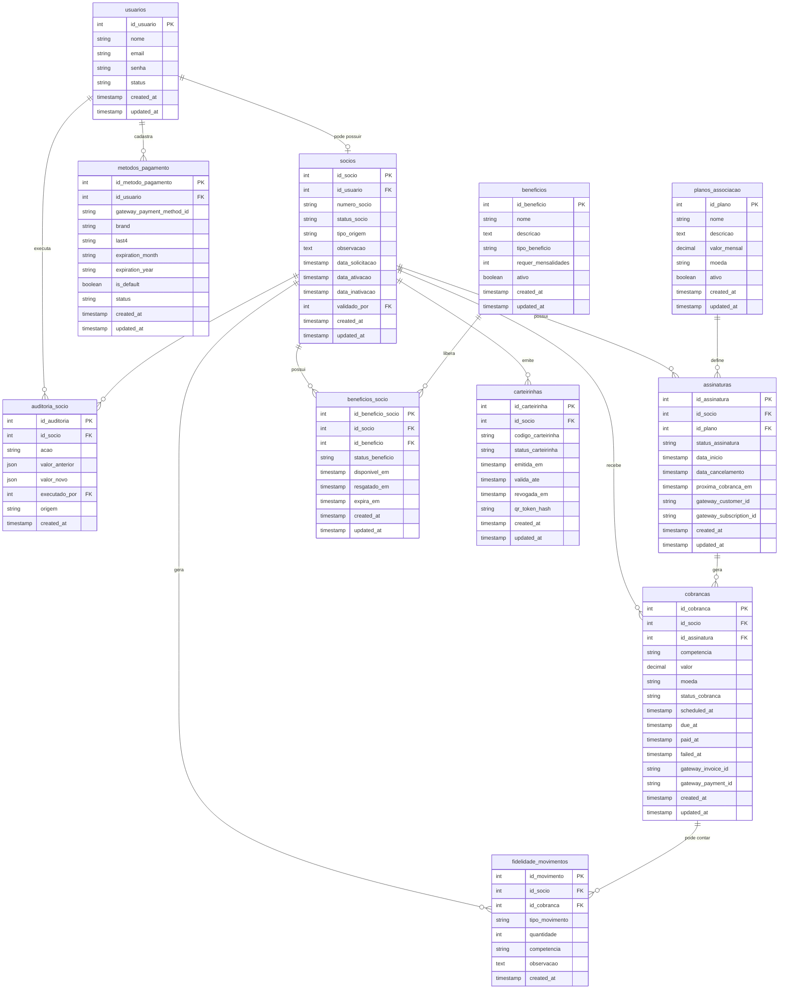

# ERD inicial — Domínio de Sócios

Este documento apresenta uma primeira proposta de relacionamento entre entidades.

O objetivo é validar o desenho antes de criar migrations.

---

## Diagrama ERD proposto



---

## Leitura do modelo

### Usuário x Sócio

`usuarios` representa a conta do app.

`socios` representa o vínculo associativo.

Relacionamento sugerido:

```txt
usuarios 1 → 0..1 socios
```

Na primeira versão, é recomendável permitir apenas um sócio ativo/vigente por usuário.

---

## Associação

`socios` concentra o status associativo.

Estados sugeridos:

```txt
pending_validation
active
inactive
blocked
cancelled
```

A associação pode vir de:

```txt
app_new
legacy_import
manual_admin
```

---

## Pagamentos

A assinatura recorrente é separada das cobranças.

```txt
socios → assinaturas → cobrancas
```

Isso permite:

- sócio sem recorrência ativa;
- sócio legado ativo sem gateway inicialmente;
- várias cobranças por assinatura;
- cobranças futuras, pendentes, pagas e falhas.

---

## Métodos de pagamento

`metodos_pagamento` pertence ao usuário, não diretamente ao sócio.

Motivo: método de pagamento é dado de conta/gateway. Caso no futuro exista outra relação financeira, o método pode continuar associado ao usuário.

Nenhum dado sensível deve ser salvo diretamente.

Permitido:

```txt
brand
last4
expiration_month
expiration_year
gateway_payment_method_id
```

Não permitido:

```txt
número completo do cartão
CVV
senha
payload sensível do gateway sem necessidade
```

---

## Fidelidade

`fidelidade_movimentos` é uma ledger/tabela de movimentos.

Isso é melhor do que manter apenas um contador no sócio, porque permite auditoria:

- pagamento contado;
- estorno;
- ajuste manual;
- resgate de benefício.

O progresso pode ser calculado por soma dos movimentos válidos.

---

## Benefícios

`beneficios` é catálogo.

`beneficios_socio` é instância do benefício liberado para um sócio.

Isso permite saber:

- quando liberou;
- se foi resgatado;
- se expirou;
- se foi cancelado.

---

## Carteirinha

`carteirinhas` depende de `socios`.

Regra sugerida:

```txt
Somente sócio active pode ter carteirinha active.
```

A carteirinha pode ser revogada sem apagar histórico.

---

## Auditoria

`auditoria_socio` registra mudanças relevantes.

Exemplos:

```txt
member_created
member_validated
member_activated
member_inactivated
member_cancelled
card_issued
card_revoked
manual_loyalty_adjustment
```

Este ponto será importante quando houver backoffice.

---

## Questões para validação antes das migrations

1. `usuarios 1 → 0..1 socios` é suficiente ou devemos permitir múltiplos vínculos históricos?
2. `numero_socio` será único e obrigatório apenas após ativação?
3. Carteirinha pode ter múltiplas emissões históricas por sócio?
4. A assinatura pertence sempre ao sócio ou pode pertencer ao usuário?
5. Benefícios resgatados devem permanecer para histórico mesmo após cancelamento do sócio?
6. Fidelidade deve ser calculada por ledger ou materializada também no sócio para performance?
7. A base legada terá número de sócio próprio que precisa ser preservado?
