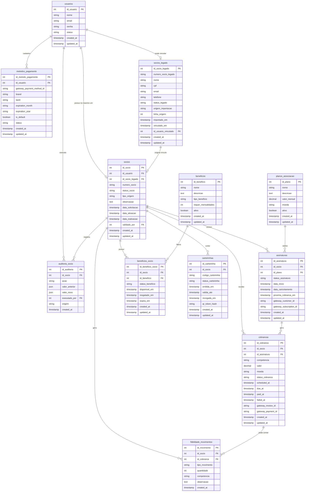

# ERD inicial — Domínio de Sócios

Este documento apresenta a proposta inicial de relacionamento entre entidades do domínio de sócios.

O objetivo é validar o desenho antes de criar migrations.

---

## Diagrama ERD proposto



---

## Leitura do modelo

### Usuário x Sócio

`usuarios` representa a conta do app.

`socios` representa o vínculo associativo.

Relacionamento confirmado para a primeira versão:

```txt
usuarios 1 → 0..1 socios
```

Um usuário não deve possuir múltiplos vínculos principais de sócio. Se o sócio muda de plano, interrompe pagamento ou é reativado, o mesmo registro de `socios` deve ser atualizado.

---

## Sócios legados

`socios_legado` representa a planilha/base atual de sócios da Savóia.

Essa tabela deve preservar:

- número de sócio legado;
- CPF ou dado único usado para conciliação;
- dados auxiliares da planilha;
- vínculo futuro com usuário do app.

Fluxo esperado:

```txt
usuário informa CPF
→ sistema busca em socios_legado
→ se encontrar, cria socios com tipo_origem = legacy_import
→ numero_socio recebe numero_socio_legado
→ status_socio inicia como inactive
→ sede/backoffice valida e ajusta fidelidade quando necessário
```

---

## Associação

`socios` concentra o status associativo.

Estados sugeridos:

```txt
pending_validation
active
inactive
blocked
cancelled
```

A associação pode vir de:

```txt
app_new
legacy_import
manual_admin
```

Para legado, a regra inicial é:

```txt
tipo_origem = legacy_import
status_socio = inactive
```

---

## Pagamentos

A assinatura recorrente é separada das cobranças.

```txt
socios → assinaturas → cobrancas
```

Isso permite:

- sócio inativo sem apagar histórico;
- mudança de plano sem criar novo sócio;
- várias cobranças por assinatura;
- cobranças futuras, pendentes, pagas e falhas.

---

## Métodos de pagamento

`metodos_pagamento` pertence ao usuário, não diretamente ao sócio.

Nenhum dado sensível deve ser salvo diretamente.

Permitido:

```txt
brand
last4
expiration_month
expiration_year
gateway_payment_method_id
```

Não permitido:

```txt
número completo do cartão
CVV
senha
payload sensível do gateway sem necessidade
```

---

## Fidelidade

`fidelidade_movimentos` é uma ledger/tabela de movimentos.

A fidelidade contará pagamentos pelo app.

Para sócio legado, a sede/backoffice poderá criar ajuste manual auditável.

Tipos importantes:

```txt
payment_counted
payment_reversed
manual_adjustment
legacy_adjustment
benefit_redeemed
```

---

## Benefícios

`beneficios` é catálogo.

`beneficios_socio` é instância do benefício liberado para um sócio.

Benefícios de sócio ativo devem depender do status atual do sócio.

---

## Carteirinha

`carteirinhas` depende de `socios`.

Regra atualizada:

```txt
A carteirinha existe para refletir o status atual do sócio.
```

Se o sócio estiver ativo, a carteirinha mostra ativo.

Se o sócio estiver inativo, a carteirinha mostra inativo.

A carteirinha de sócio inativo não deve permitir benefícios exclusivos de sócio ativo.

---

## Auditoria

`auditoria_socio` registra mudanças relevantes.

Exemplos:

```txt
member_created
legacy_member_linked
member_validated
member_activated
member_inactivated
member_cancelled
card_issued
card_status_changed
manual_loyalty_adjustment
legacy_loyalty_adjustment
```

Este ponto será importante quando houver backoffice.

---

## Questões para validação antes das migrations

1. CPF será obrigatório no cadastro inicial ou somente na etapa de associação/perfil?
2. Como será armazenado CPF com segurança?
3. Qual será o formato exato da planilha legada?
4. O vínculo com legado será automático quando CPF bater ou exigirá revisão da sede?
5. Qual regra de atraso muda sócio para inativo?
6. Reativação por pagamento será automática ou manual?
7. Carteirinha terá código próprio além do número de sócio?
